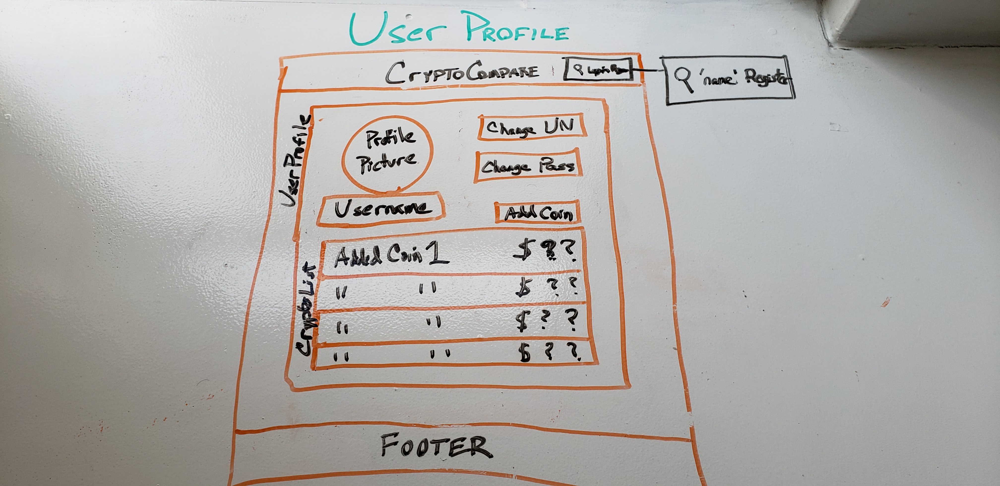

# CryptoCompare
Welcome to CryptoCompare! This app will allow you to view the current price for a list of cryptocurrencies.

https://afternoon-tor-10137.herokuapp.com/

### Components
* Nav - contains title and login/register buttons
* Login - logs in user
* Register - creates a new user
* UserProfile - changes the view to user profile view
* CryptoList - contains a list of coins and prices
* CryptoCoin - each coin in a user's favorited coins
* CryptoDetail - detail of each coin when clicked

### ERD/Database Design
* PostgreSQL Database
* 2 tables: Users & Coins
* Users and Coins have a many-to-many relationship

### MVP
* Set up backend with Users and coins
* Seed data from coinmarketcap api to database then pull coin data from database to front end
* Set up authentication
* Set up sort buttons for cryptos
* Set up pagination to display pages of 50 cryptos

### Post-MVP
* Set up coins users have favorited
* User profile page displayind favorited crypto
* CryptoDetail view, which gives you more info on the crypto when clicked

### Tech
Ruby | Rails | Javascript
--- | --- | ---
axios | React | bcrypt
eslint | cors | body-parser
react-hooks | passport/jwt |jsonwebtoken

### Wireframes

